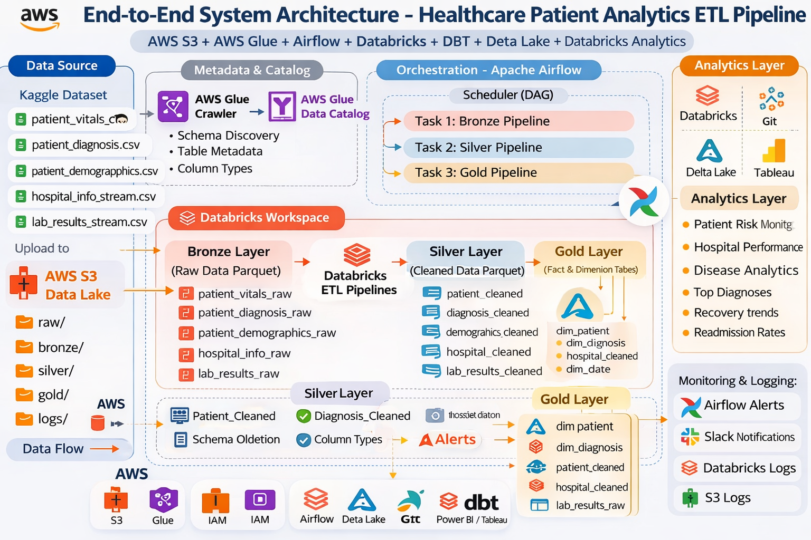
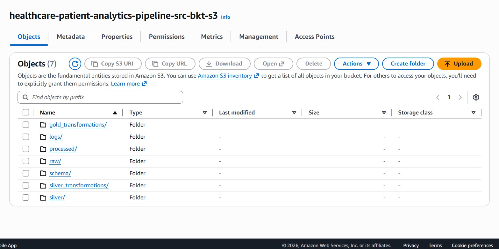
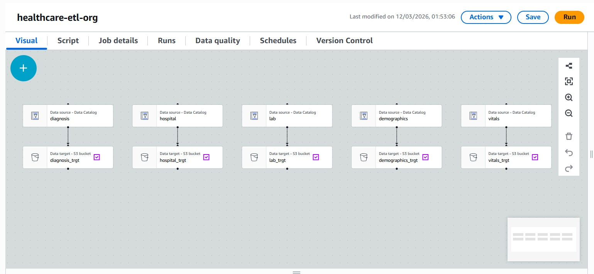
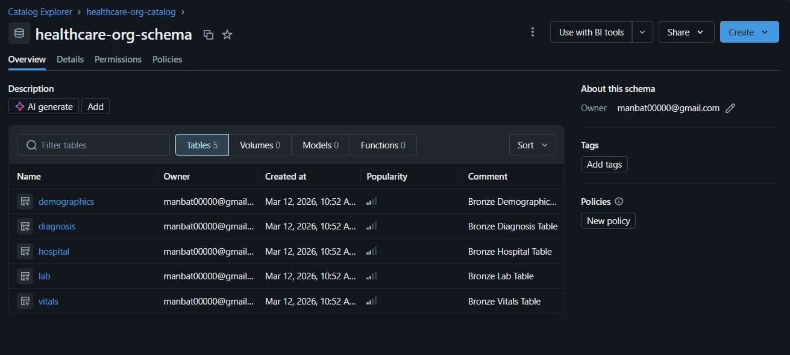
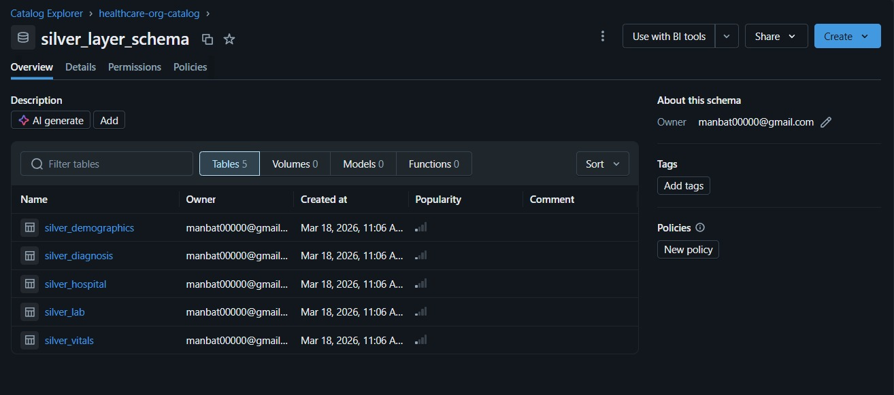
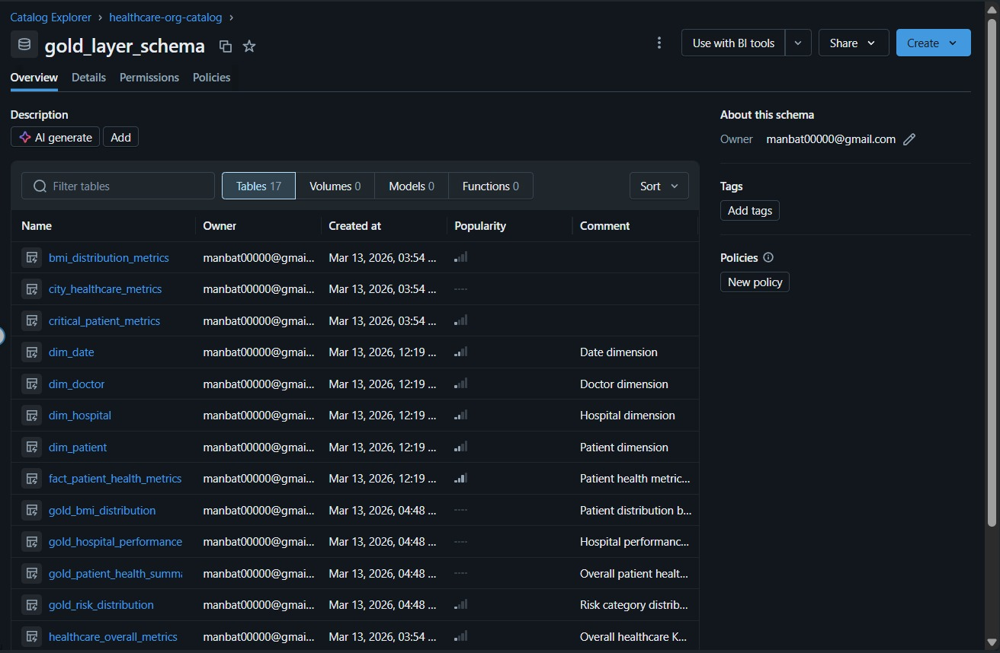
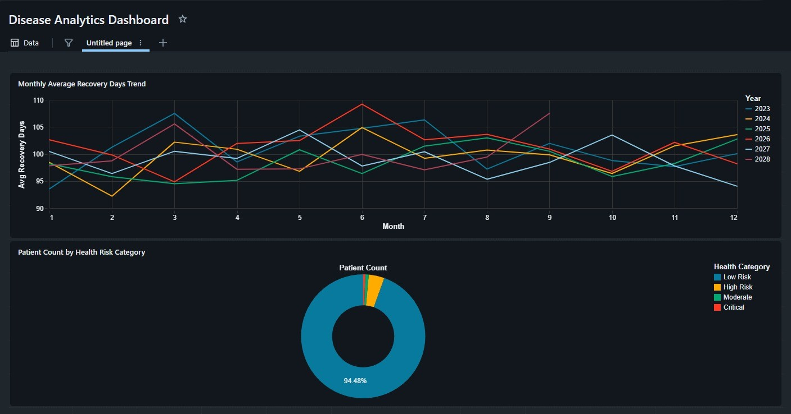
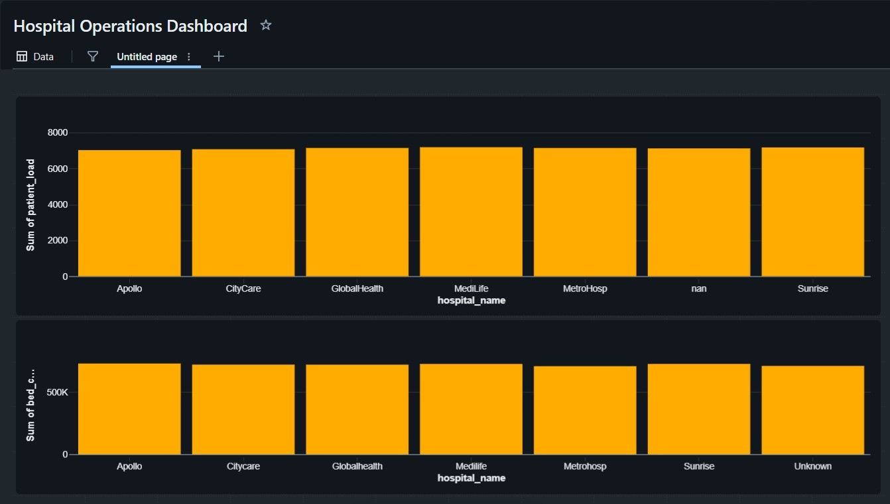
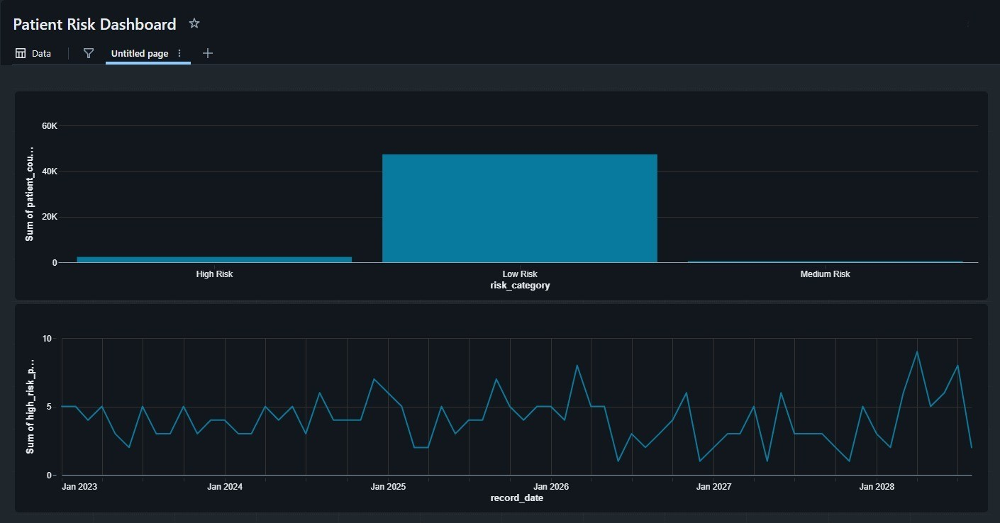
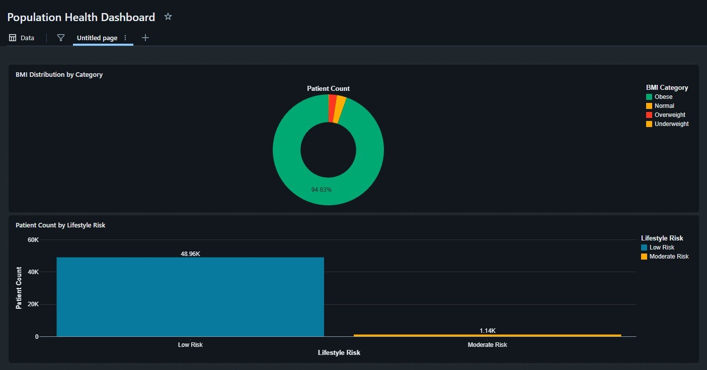

# Healthcare Patient Analytics Pipeline (Databricks + AWS)

## Project Overview

This project implements an end-to-end Healthcare Patient Analytics Pipeline using AWS, Databricks, PySpark, and Delta Lake.

The pipeline ingests raw patient clinical and demographic records from AWS S3, processes and enriches it through a structured Medallion Architecture (Bronze → Silver → Gold), and generates business-ready analytics tables.

It incorporates daily batch processing, robust error handling, data quality validation, and automated alerting, ensuring scalability, reliability, and maintainability.

The final output enables healthcare providers to analyze patient risks, hospital performance, and diagnosis trends.

## Healthcare Patient Analytics Lakehouse Data Mart

This project follows a **Lakehouse** approach (data lake storage + warehouse reliability via Delta Lake) and publishes curated **data mart** tables for analytics.

- **Lakehouse layers**: Bronze (raw) → Silver (cleaned/validated) → Gold (aggregated metrics/KPIs)
- **Data mart outputs**: Gold tables designed for BI dashboards and specialized analytics
- **Governance**: Data schema is managed to ensure discoverability and quality

## Dataset

### Dataset Source

- **File name**: Multiple CSV files (`hospital_info.csv`, `lab_results.csv`, `patient_demographics.csv`, `patient_diagnosis.csv`, `patient_vitals.csv`)
- **Source**: Kaggle - https://www.kaggle.com/datasets/johnfadnavis/heart-dataset

### Dataset Description

#### Tables and Columns included

- `hospital_info.csv`: `hospital_id`, `hospital_name`, `city`, `state`, `record_date`, `bed_capacity`, `icu_beds`, `staff_count`, `patient_load`, `equipment_score`, `avg_wait_time`, `surgery_count`, `emergency_cases`, `infection_rate`, `utilization_rate`
- `lab_results.csv`: `patient_id`, `lab_test_name`, `hospital_name`, `technician_name`, `record_date`, `hemoglobin`, `platelets`, `wbc_count`, `rbc_count`, `creatinine`, `sodium`, `potassium`, `calcium`, `bilirubin`, `test_cost`
- `patient_demographics.csv`: `patient_id`, `patient_name`, `gender`, `city`, `record_date`, `age`, `income_index`, `health_score`, `lifestyle_risk`, `exercise_hours`, `sleep_hours`, `alcohol_index`, `smoking_index`, `diet_score`, `insurance_score`
- `patient_diagnosis.csv`: `patient_id`, `diagnosis_code`, `doctor_name`, `hospital_name`, `record_date`, `severity_score`, `risk_probability`, `treatment_cost`, `medication_count`, `visit_duration`, `readmission_risk`, `insurance_claim`, `procedure_count`, `recovery_days`, `comorbidity_score`
- `patient_vitals.csv`: `patient_id`, `patient_name`, `hospital_name`, `record_date`, `device_type`, `heart_rate`, `blood_pressure_sys`, `blood_pressure_dia`, `oxygen_level`, `body_temp`, `respiration_rate`, `glucose_level`, `cholesterol`, `bmi`, `stress_index`

#### Key features explanation

- **Demographics & ID**: `patient_demographics.csv` provides foundational patient information including lifestyle and health scores.
- **Vitals & Measurements**: `patient_vitals.csv` records physiological metrics captured by healthcare devices.
- **Lab Results**: `lab_results.csv` monitors blood work profiles and essential mineral levels.
- **Clinical History & Diagnosis**: `patient_diagnosis.csv` outlines medical histories, diagnoses, recovery days, and treatment costs.
- **Hospital Info**: `hospital_info.csv` details facility metrics such as bed capacity, ICU beds, staff count, and utilization rates.

## Lakehouse Architecture(Medallion)



This project integrates AWS services with Databricks to build a scalable data pipeline.

### Components used

- **AWS S3**: Raw data storage
- **AWS Glue Crawler & Data Catalog**: Schema inference & metadata
- **Databricks Workflows**: Pipeline orchestration
- **Databricks**: Data processing & analytics
- **Delta Lake**: Reliable storage with ACID properties

### Data flow

```text
Healthcare Records (multiple CSVs)
            ↓
          AWS S3
            ↓
     AWS Glue Crawler
            ↓
  Bronze Layer (Databricks)
            ↓
  Silver Layer (Databricks)
            ↓
  Gold Layer (Metrics & Analytics)
            ↓
    Reporting / BI Dashboards
            ↓
   Airflow Orchestration
```

### S3 layout (example used in this repo)

- **Raw CSV (sensor input)**: Raw patient records uploaded to an AWS S3 bucket.
- **Processed Data (Bronze input)**: Read via AWS Glue Data Catalog.



### Glue job (example used in this repo)

- **Glue Crawler**: Automatically infers the schema from S3 and registers it in the Glue Data Catalog.



### Orchestration (Databricks Workflows)

The entire ETL workflow is mapped out as a Directed Acyclic Graph (DAG) using **Databricks Workflows**. Task DAG established: `bronze_ingestion_task` ➔ `silver_transformation_task` ➔ `gold_analytics_task`.

## Lakehouse Architecture (Medallion)

### Bronze Layer

- **Function**: Historical archive of all ingested data with no data truncation.



**Operations**

- Spark connects to the AWS Glue metastore to read predefined schemas.
- Audit metadata (`_ingestion_timestamp`, `_source_file`, `_batch_id`, `_ingestion_date`) is injected.
- Stored in S3 using Delta format partitioned by `_ingestion_date`.

### Silver Layer



- **Function**: Enforcing schema validation and data hygiene.

**Transformations**

- Removed null values (e.g., dropped rows with missing identifiers and handled categorical nulls).
- Did data standardisations (e.g., normalized values for gender, string formatting).
- Removed anomalies and performed clinical range validation to ensure data hygiene.
- Deduplication using Spark `MERGE` to prevent duplicate patient records across daily batch runs.

### Gold Layer



#### Analytics tables (Data Model)

- **Fact Table**: `fact_patient_health_metrics`
- **Dimension Tables**: `dim_patient`, `dim_hospital`, `dim_diagnosis`, `dim_date`

#### Features generated

- Unified risk score (0-100) based on clinical factors (Age, BP, BMI, etc.)
- Total patients, doctors, average vitals, and morbidity percentages partitioned by `hospital_id`
- Patient counts and average clinical metrics grouped by `diagnosis_code`
- Historical record of system-wide processing metrics

## Delta Lake Features

### Time Travel (Delta history & rollback)

Delta tables support querying older versions, which provides the ability to audit data changes and rollback if issues are detected during pipeline runs.

### Schema Evolution

The architecture leverages Delta Lake's schema evolution and merge capabilities (`whenMatchedUpdateAll()` and `whenNotMatchedInsertAll()`) to handle new data structures gracefully.

## Data Quality Validation

### Current validations implemented (in PySpark)

Validations are enforced primarily in the Silver layer using a custom Data Quality framework:

- Null rate threshold constraints (e.g., max 5% null rate on Systolic BP)
- Pipeline halts if critical thresholds are breached
- Missing `patient_id` drops
- Duplicate thresholds and exact duplicate drops
- Out-of-range clinical value handling (e.g. setting to Null)

## Error Handling & Alerting

### Error handling

- **Automated Validation**: Restricts bad data from passing through the pipeline.
- **Event Logging**: Centralized `pipeline_log` Delta table captures pipeline duration, row counts, and explicit error messages with UUID trace IDs.
- **Try/Catch Implementation**: PySpark scripts are encapsulated in Python `try/except` execution blocks to ensure Workflows capture hard failures accurately.

### Alerting (integration approach)

- **Email Alerts**: Configured custom email failure alerting for job states in Databricks Workflows.

## Airflow Orchestration

Orchestrated using Databricks Workflows and Apache Airflow.

### Workflow

- **Step 1**: AWS Glue Crawler registers schema
- **Step 2**: Databricks Workflow
  - Bronze Ingestion Task
  - Silver Transformation Task
  - Gold Analytics Task

### Scheduling

- Automated to run daily at `0 2 * * *` (2:00 AM UTC).
- Directed Acyclic Graph (DAG) task execution

## Data Quality Checks

Implemented across layers before commits:

- Null value validation
- Duplicate detection
- Standardized data types
- Out-of-range constraint enforcement

### Monitoring

- Custom logging framework writing to `pipeline_log` table
- Databricks job run logs
- Email alerts for job failures

## Testing

Layer-wise validation ensures correctness and reliability.

### Coverage

- Ingestion validation
- Transformation logic
- Feature engineering correctness (conditional weights for risk scores)

## Project Structure

```text
healthcare-pipeline
│
├── Dashboard/images
│
├── Datasets
│
├── Development
│
├── testing
│
├── .gitignore
│
└── README.md
```

## Pipeline Execution Flow

```text
AWS Glue Crawler
      ↓
Databricks Bronze Ingestion
      ↓
Databricks Silver Transformation
      ↓
Databricks Gold Analytics
      ↓
Reporting / BI Dashboards
      ↓
Airflow Orchestration
```

## Technologies Used

- Python
- PySpark
- Databricks (Workflows)
- Delta Lake
- AWS S3
- AWS Glue (Crawlers & Data Catalog)
- AWS IAM (Custom Roles and Policies)
- Spark SQL
- Apache Airflow (Orchestration)

## Business Insights & Dashboards

The curated Gold layer feeds directly into BI tools for advanced hospital and patient analytics.

### Dashboard Previews






## Business Impact

- Readily identifies high-risk patients for early intervention
- Optimizes hospital performance tracking
- Tracks diagnosis prevalence and trend analysis
- Provides a clean, historically accurate data foundation

## Future Enhancements

- Real-time streaming pipeline integration for continuous vitals
- ML model integration for advanced risk prediction
- More comprehensive BI dashboards and integration
- Enhanced automated data quality monitoring tooling
